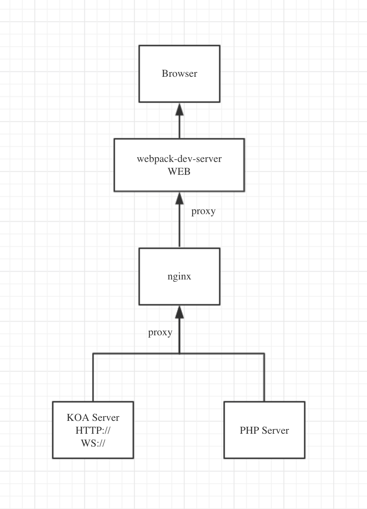
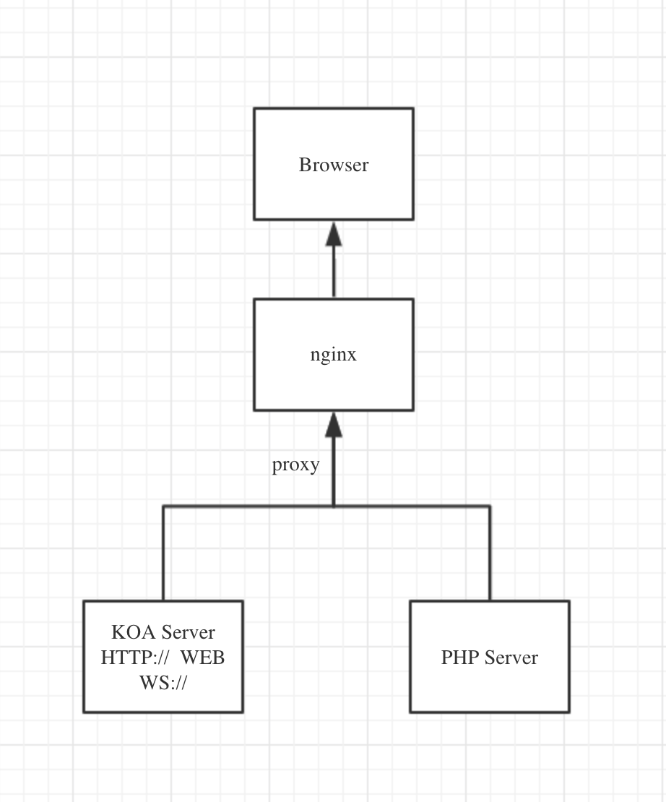

## 优粉吧 运营平台

### 项目使用

1. 安装 pm2

```sh
npm install pm2 -g
```

2. 安装 nginx

[nginx 官网](https://nginx.org/en/)

- mac 下载 nginx 安装使用

  - 安装

    建议使用[homebrew](https://brew.sh/)进行安装

  ```sh
  brew install nginx
  #或者
  sudo brew install nginx
  ```

  nginx 被安装在 `/usr/local/etc/nginx`

  - 使用

  ```sh
  # nginx 启动
  nginx

  # nginx 停止
  nginx -s stop

  # nginx 重启
  nginx -s reload
  ```

  - nginx 配置

    nginx 的配置文件在`/usr/local/etc/nginx/nginx.conf`

- window 下载 nginx 安装使用

  - 安装

    直接去[nginx](https://nginx.org/en/download.html)官方下载。直接下载免安装包解压就可以了。

  - 使用

    下面命令是基于 nginx 解压在 C:\server\目录下

  ```sh
  # nginx 启动， 双击`nginx.exe` 或者使用下面命令
  # 建议使用第一种，第二种会使你的cmd窗口一直处于执行中，不能进行其他命令操作。
  C:\server\nginx-1.14.2>start nginx
  #或
  C:\server\nginx-1.14.2>nginx.exe

  # nginx 停止
  C:\server\nginx-1.14.2>nginx.exe -s stop
  #或
  C:\server\nginx-1.14.2>nginx.exe -s quit

  # nginx 重启
  C:\server\nginx-1.14.2>nginx.exe -s reload

  # 重新打开日志文件
  C:\server\nginx-1.14.2>nginx.exe -s reopen

  # nginx版本
  C:\server\nginx-1.14.2>nginx -v
  ```

* nginx 配置

```sh
# yfb.op.portal.new (运营后台)项目服务配置
server {
    listen       9240;
    server_name  localhost;

    # node 服务地址
    location / {
        proxy_pass http://localhost:3240;
    }

    # 远程服务地址
    location ~ /(api|simg)/ {
        proxy_pass https://admin-yfb-q2.youfenba.com;
    }

    # node socket 服务地址
    location /kapi/socket/ {
        proxy_pass http://localhost:3024/kapi/socket/;
        proxy_set_header Upgrade $http_upgrade;
        proxy_set_header Connection "Upgrade";
    }
}

```

3. 安装`package.json`中依赖

```sh
npm install
```

4. 开发环境启动服务

```sh
# 启动node 服务
npm run pm2:dev
# 或者
npm run nodemon:dev

# 开始编译react
npm run start

# 或者
npm run dev
```

注意 ⚠️: 如过使用到 nginx 请确保 nginx 已经启动

### Prettier - Code formatter

- vsCode 安装`Prettier - Code formatter`插件

- 设置`setting` 当保存文件时编辑器或自动格式化文件

  ```json
      "editor.formatOnSave": true
  ```

### 模版说明

该项目使用[`ejs`](https://ejs.co/)做为页面模版

```sh
npm install ejs --save
```

### 脚本介绍

```sh
# 安装项目依赖
npm install
# 或者
yarn install

# 开启开发环境react 编译
npm run start

# 开启开发环境react 编译
npm run dev

# 开始编译测试或生产环境
npm run build

# 启动本地node开发环境
# 注意⚠️: 如果你开发node最好使用这个命令，因为它会自动重启和在控制太打印日志方便开发和调试
# 开启开发环境 前提是全局安装了pm2
npm run pm2:dev

# 使用nodemon 可直接看到node 服务的日志
npm run nodemon:dev

# 启动pm2服务 可以选择环境[release| production]
npm run pm2

# 停止或删除pm2服务
npm pm2:stop

# 进行eslint语法检查, 如果有错会在控制中指出
npm run lint

# 对部分不符合eslint 语法进行修复
# 注意⚠️: 不是所有的错误都会修复，部分还是要手动修复
npm run fix
```

### antd 配置

```
npm install antd --save

npm install babel-plugin-root-import --save-dev
```

### 公共组件说明 `src/public/components`

- IconFont

```jsx
// type 是对应iconfont上图标值
<IconFont type="icon-pinglun" style={{ color: 'red' }} />
```

注意 ⚠️ 图标的选取最好是选择单身图标，因为单色图标可以设置颜色

- Image

```jsx
<Image defaultSrc="" src="" className="" />
```

主要是解决图片路径是相对路径的问题

#### koa 服务文档说明

```js
.
├── controllers  // 控制器
│   └── index.js
├── index.js  // 服务器入口
├── middleware // 中间件
│   ├── index.js
│   └── logger.js // 日志中间件
├── route // 路由
│   ├── api // 路由
│   │   └── index.js
│   └── render
├── socket // socket
│   └── index.js
└── utils // 工具类
    └── index.js
```

| 项目名 | 9xxx | 3xxx | 3xxx |
| ------ | ---- | ---- | ---- |
| √      | 9100 | 3100 | 3010 |
| √      | 9110 | 3110 | 3011 |
| √      | 9120 | 3120 | 3012 |
| √      | 9130 | 3130 | 3013 |
| √      | 9140 | 3140 | 3014 |
| √      | 9150 | 3150 | 3015 |
| √      | 9160 | 3160 | 3016 |
| √      | 9170 | 3170 | 3017 |
| √      | 9180 | 3180 | 3018 |
| √      | 9190 | 3190 | 3019 |
| √      | 9200 | 3200 | 3020 |
|        | 9210 | 3210 | 3021 |
|        | 9220 | 3220 | 3022 |
|        | 9230 | 3230 | 3023 |
| √      | 9240 | 3240 | 3024 |
|        | 9250 | 3250 | 3025 |
|        | 9260 | 3260 | 3026 |
|        | 9270 | 3270 | 3027 |
|        | 9280 | 3280 | 3028 |
|        | 9290 | 3290 | 3029 |
|        | 9300 | 3300 | 3030 |
|        | 9310 | 3310 | 3031 |
|        | 9320 | 3320 | 3032 |
|        | 9330 | 3330 | 3033 |
|        | 9340 | 3340 | 3034 |
|        | 9350 | 3350 | 3035 |
|        | 9360 | 3360 | 3036 |
|        | 9370 | 3370 | 3037 |
|        | 9380 | 3380 | 3038 |
|        | 9390 | 3390 | 3039 |
| √      | 9400 | 3400 | 3040 |
|        | 9410 | 3410 | 3041 |
|        | 9420 | 3420 | 3042 |
|        | 9430 | 3430 | 3043 |
|        | 9440 | 3440 | 3044 |
|        | 9450 | 3450 | 3045 |
|        | 9460 | 3460 | 3046 |
|        | 9470 | 3470 | 3047 |
|        | 9480 | 3480 | 3048 |
|        | 9490 | 3490 | 3049 |
|        | 9500 | 3500 | 3050 |
|        | 9510 | 3510 | 3051 |
|        | 9520 | 3520 | 3052 |
|        | 9530 | 3530 | 3053 |
|        | 9540 | 3540 | 3054 |

## 服务流程导图

- 开发环境

  

- 生产环境

  

## 菜单

### v0.1.0

- 概况 (`/dashboard`)

  - 运营看板 (`/dashboard/operation`)

- 渠道

  - 渠道管理 (`/channel/manage`)

- 数据

  - 渠道指标 (`/data/indicators`)
  - 渠道走势 (`/data/trend`)
  - 接单指标 (`/data/order`)
  - 留存指标 (`/data/extant`)

## 测试地址

`https://admin-yfb-q2.youfenba.com`
